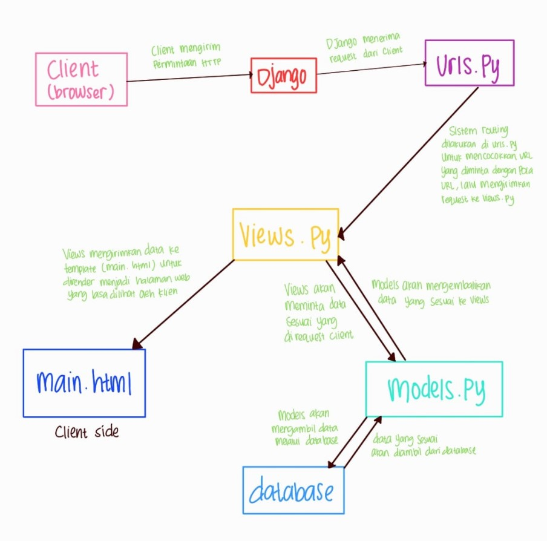

# dilly_dolly

PWS : http://fakhriyah-ghania-dillydolly.pbp.cs.ui.ac.id/

# Tugas 2
Pertanyaan :
1. Jelaskan bagaimana cara kamu mengimplementasikan checklist di atas secara step-by-step (bukan hanya sekadar mengikuti tutorial).
Jawab : 
1) Membuat sebuah proyek Django baru
- Langkah pertama adalah melakukan inisiasi repositori di Github yang saya namakan dilly_dolly dan mengatur repo menjadi public serta menambahkan berkas README.md saat ingin membuat repo sebagai tempat untuk menjawab pertanyaan.
- Setelah itu, saya melakukan cloning ke komputer lokal dengan cara menggunakan command prompt pada direktori lokal yang nantinya akan menjadi direktori utama proyek ini. Saya menjalankan perintah git clone https://github.com/gwaniea/dilly_dolly.git untuk menduplikasi seluruh repo ke komputer lokal.
- Selanjutnya, saya membuka command prompt pada direktori dilly_dolly yang sudah saya clone dari Github dan membuat virtual environment dengan perintah python -m venv env lalu mengaktifkannya dengan perintah env\Scripts\activate. Tujuan dari virtual environment ini untuk mengisolasi package dan dependencies dari aplikasi agar tidak bertabrakan dengan versi lain yang ada di komputer lokal. Mengaktifkan virtual environment berarti membuat ruang kerja terpisah di mana saya dapat menginstal package dan dependencies tanpa memengaruhi proyek lainnya yang ada di komputer saya.
- Kemudian, saya membuat file requirements.txt di dalam direktori tersebut dan menambahkan beberapa dependencies (seperti yang ada di tutorial 0). Saya melakukan instalasi terhadap dependencies dengan perintah pip install -r requirements.txt.
- Selanjutnya, saya membuat proyek Django bernama dilly_dolly dengan perintah django-admin startproject dilly_dolly . (setelah perintah ini, akan terdapat direktori baru bernama dilly_dolly di dalam direktori utama)
- Setelah itu, saya menambahkan "localhost" dan "127.0.0.1" pada ALLOWED_HOSTS di settings.py (settings.py ada di dalam direktori proyek dilly_dolly) untuk memberikan izin akses dari host lokal. Untuk menandakan berhasil atau tidaknya aplikasi Django dibuat, saya menjalankan perintah python manage.py runserver dan membuka http://localhost:8000/ dan melihat animasi roket (aplikasi Django berhasil dibuat)
- Selanjutnya, saya menambahkan berkas .gitignore pada direktori utama yang isinya adalah berkas-berkas dan direktori-direktori yang harus diabaikan oleh Git.
- Terakhir, saya melakukan add, commit, dan push dari direktori repo lokal.
2) Membuat aplikasi dengan nama main pada proyek tersebut.
- Sebelum membuat aplikasi main, saya memastikan bahwa virtual environment dalam keadaan aktif terlebih dahulu. Selanjutnya, saya menjalankan perintah python manage.py startapp main untuk membuat aplikasi main (setelah ini, direktori baru bernama main yang isinya adalah struktur awal aplikasi Django akan terbentuk)
- Kemudian, saya menambahkan aplikasi main ke dalam daftar aplikasi INSTALLED_APPS di settings.py (settings.py ada di dalam direktori proyek dilly_dolly)
3) Melakukan routing pada proyek agar dapat menjalankan aplikasi main.
- Pertama, saya menambahkan rute URL dalam urls.py proyek untuk menghubungkannya ke tampilan aplikasi main. Dalam file urls.py pada direktori proyek dilly_dolly, saya mengimpor fungsi include dari django.urls dan menambahkan rute URL, yaitu path('', include('main.urls')), untuk mengarahkan ke tampilan main. Fungsi include digunakan untuk impor rute URL dari aplikasi lain ke dalam file urls.py proyek.
4) Membuat model pada aplikasi main dengan nama Product dan memiliki atribut wajib name, price, dan description.
- Pertama, saya membuka berkas models.py pada direktori aplikasi main.
- Saya mengisi model dengan kode berikut :

from django.db import models
class Product(models.Model):
    name = models.CharField(max_length=255) 
    price = models.IntegerField()             
    description = models.TextField()
    category = models.CharField(max_length=255,  default='Uncategorized')
    stock = models.IntegerField(default=0)

Kode ini merepresentasikan tabel di database. Setiap atribut dalam kelas ini akan menjadi kolom di tabel database yang sesuai dan masing-masing baris di tabel akan mewakili satu entri produk. Berikut detailnya :
- name: Nama produk dengan panjang maksimal 255 karakter.
- price: Harga produk yang disimpan sebagai bilangan bulat.
- description: Deskripsi produk yang panjangnya tidak terbatas.
- category: Kategori produk dengan nilai default "Uncategorized" jika tidak diisi. (atribut tambahan)
- stock: Jumlah stok produk dengan nilai default 0 jika tidak diisi. (atribut tambahan)

- Selanjutnya, saya melakukan migrasi model dengan menjalankan perintah python manage.py makemigrations untuk membuat berkas migrasi yang berisi perubahan model yang belum diaplikasikan ke dalam database. Kemudian, saya menjalankan perintah python manage.py migrate untuk menerapkan perubahan model.
5) Membuat sebuah fungsi pada views.py untuk dikembalikan ke dalam sebuah template HTML yang menampilkan nama aplikasi serta nama dan kelas.
- Pertama, saya membuka berkas views.py pada direktori aplikasi main.

- Kemudian, saya menambahkan fungsi berikut :

def show_main(request):
    context = {
        'app': 'Dilly Dolly',  
        'nama': 'Fakhriyah Ghania Putri',  
        'kelas': 'PBP B' 
    }

    return render(request, "main.html", context)

Kode ini untuk mendefinisikan fungsi show_main yang menerima parameter request. Fungsi ini akan memproses request yang masuk dari pengguna, lalu mengirimkan data ke template untuk ditampilkan. Data ini memuat informasi app, nama, dan kelas.
6) Membuat sebuah routing pada urls.py aplikasi main untuk memetakan fungsi yang telah dibuat pada views.py.
- Pertama, saya membuat berkas urls.py di dalam direktori main untuk mengatur rute URL terkait aplikasi main. Saya mengimpor path dari django.urls untuk menentukan pola URL dan mengaitkannya dengan tampilan fungsi show_main dari main.views. Ketika URL diakses, maka web akan menampilkan fungsi show_main pada views.py yang sudah didefinisikan sebelumnya. Selain itu, saya juga mendefinisikan variabel app_name (isinya 'main') untuk menentukan nama unik untuk pola URL yang ada di aplikasi tersebut supaya tidak bertabrakan dengan aplikasi lain yang memiliki pola URL yang sama.
7) Melakukan deployment ke PWS terhadap aplikasi yang sudah dibuat sehingga nantinya dapat diakses oleh teman-temanmu melalui Internet.
- Saya membuat proyek baru dengan menekan tombol Create New Project. Kemudian, saya mengisi Project Name dengan dillydolly dan menekan tombol Create New Project.
- Selanjutnya, pada settings.py di proyek Django, saya menambahkan URL Deployment PWS pada ALLOWED_HOST. Sekarang ALLOWED_HOST saya terlihat seperti ini:

ALLOWED_HOSTS = ["localhost", "127.0.0.1", "fakhriyah-ghania-dillydolly.pbp.cs.ui.ac.id"]

- Setelah itu, saya melakukan git add, commit, dan push.
- Selanjutnya, saya menjalankan perintah yang terdapat pada informasi Project Command PWS. Kemudian, saya menjalankan perintah git branch -M main untuk mengubah nama branch utama menjadi main kembali. Setiap ada perubahan, seperti menambahkan atribut pada model, saya melakukan migrasi (khusus perubahan pada model) dan push ke PWS dengan perintah git push pws main:master.
8) Membuat sebuah README.md yang berisi tautan menuju aplikasi PWS yang sudah di-deploy, serta jawaban dari beberapa pertanyaan berikut.
- Saya telah membuat berkas README.md saat membuat repositori baru. Isinya adalah jawaban dari pertanyaan beserta link PWS.

Buatlah bagan yang berisi request client ke web aplikasi berbasis Django beserta responnya dan jelaskan pada bagan tersebut kaitan antara urls.py, views.py, models.py, dan berkas html.
Jawab:

Jelaskan fungsi git dalam pengembangan perangkat lunak!
Jawab:
Fungsi Git adalah untuk melacak perubahan dalam kode selama pengembangan proyek. Git dapat melacak setiap perubahan dalam kode dari waktu ke waktu sehingga pengguna dapat melihat riwayat semua perubahan yang terjadi pada kode. Selain itu, Git juga mendukung kolaborasi tim tanpa mengganggu pekerjaan masing-masing. Setiap anggota tim dapat mengerjakan bagiannya masing-masing, lalu menggabungkannya. Git juga dapat menjadi backup karena sistemnya yang terdistribusi. Ini berarti developer memiliki salinan dari seluruh riwayat proyeknya. Selain itu, Git berfungsi untuk memudahkan proses pengembangan dan maintenance perangkat lunak akibat adanya tools CI/CD untuk melakukan build, test, integrate, deliver, dan deploy secara otomatis.

Menurut Anda, dari semua framework yang ada, mengapa framework Django dijadikan permulaan pembelajaran pengembangan perangkat lunak?
Jawab:
Menurut saya, Django praktis karena pengguna tidak perlu membangun semuanya dari awal. Banyak tools yang disediakan dari framework ini, seperti routing dan lainnya, sehingga memudahkan pengguna dalam membangun web. Struktur Django juga cukup beginner-friendly sehingga saya bisa memahami bagaimana aplikasi web dibangun secara terpisah (models, views, templates). 

Mengapa model pada Django disebut sebagai ORM?
Jawab: 
Model pada Django disebut sebagai ORM (Object-Relational Mapping) karena Django memetakan objek-objek dalam models ke dalam tabel-tabel database. Misalnya, dalam models.py, terdapat atribut name, price, description, category, dan stock, kemudian ORM akan menerjemahkan model tersebut ke dalam tabel database dengan kolom dan baris yang sesuai.

# Tugas 3

Pertanyaan:
1. Jelaskan mengapa kita memerlukan data delivery dalam pengimplementasian sebuah platform?
Jawab:
Data delivery diperlukan untuk adanya pertukaran data/informasi antar berbagai komponen dalam sistem (server dan klien). Dengan adanya data delivery, data yang dibutuhkan dapat diakses dengan cepat, akurat, dan aman. Selain itu, platform juga dapat menampilkan konten yang dinamis dan up-to-date sehingga meningkatkan kinerja platform. Hal ini tentunya sangat penting karena, tanpa data delivery, platform akan kehilangan fungsinya dalam mentransfer data sehingga mengakibatkan platform kurang bermanfaat bagi pengguna. Misalnya, dalam e-commerce, data delivery dibutuhkan untuk meng-update produk, harga, dan stok secara real-time. Jika tidak ada data delivery, pengguna akan melihat informasi yang tidak valid karena tidak ada perubahan pada informasi.

2. Menurutmu, mana yang lebih baik antara XML dan JSON? Mengapa JSON lebih populer dibandingkan XML?
Jawab:
Menurut saya, keduanya dapat digunakan sesuai pada kebutuhan platform. Walaupun JSON lebih populer dibanding XML, tetapi XML lebih cocok digunakan pada data yang kompleks sebab XML lebih efisien dalam pengecekan error dan unggul dalam penyusunan struktur data (terutama data yang kompleks) dibandingkan JSON. Namun, JSON memiliki kelebihan yang membuatnya lebih populer dari XML. Pertama, JSON lebih ringkas dibandingkan XML. JSON menggunakan lebih sedikit tag markup dan memiliki struktur yang lebih sederhana sehingga mengurangi ukuran data yang dikirim. Kedua, JSON lebih mudah dibaca oleh manusia dan terlihat lebih rapi dibandingkan XML. Ketiga, proses parsing data JSON lebih cepat dibandingkan XML. JSON sudah didukung secara native oleh banyak bahasa pemrograman, sedangkan XML memerlukan parsing yang lebih kompleks. 

Meskipun XML lebih tua, bahasa ini dapat menetapkan aturan dan struktur yang membuat pertukaran data menjadi universal, sedangkan JSON adalah data format yang lebih modern dengan tujuan yang sama seperti XML. JSON lebih populer dalam data delivery karena file yang dihasilkannya lebih ringan dan cepat. Sementara itu, XML lebih unggul dalam hal penyusunan struktur data.

3. Jelaskan fungsi dari method is_valid() pada form Django dan mengapa kita membutuhkan method tersebut?
Jawab:
Method is_valid() digunakan untuk memvalidasi isi form Django. Method ini akan memeriksa apakah data yang dikirimkan dalam form sesuai dengan format yang telah ditentukan, misalnya apakah tipe datanya benar, panjang karakter valid, dan lainnya. Jika data valid, method ini akan mengembalikan nilai boolean True, sedangkan, jika data tidak valid, method ini akan mengembalikan nilai boolean False. Kita membutuhkan method ini untuk memastikan bahwa data yang diinput oleh pengguna sudah sesuai dan tidak ada kesalahan yang menyebabkan data tidak valid sebelum disimpan ke database.

4. Mengapa kita membutuhkan csrf_token saat membuat form di Django? Apa yang dapat terjadi jika kita tidak menambahkan csrf_token pada form Django? Bagaimana hal tersebut dapat dimanfaatkan oleh penyerang?
Jawab:
csrf_token adalah token yang berfungsi sebagai security untuk melindungi aplikasi dari serangan CSRF (Cross-Site Request Forgery). Token ini di-generate secara otomatis untuk mencegah serangan siber. Token ini memastikan bahwa setiap form yang di-submit berasal dari sumber yang sah, yaitu dari situs web itu sendiri, bukan dari situs pihak ketiga yang mencoba melakukan serangan.

Jika tidak ada csrf_token, aplikasi menjadi rentan terhadap serangan CSRF. Penyerang dapat membuat pengguna melakukan sesuatu tanpa mereka sadari, seperti mengirimkan data atau mengubah informasi penting tanpa persetujuan pengguna. Penyerang bahkan bisa mendapatkan kendali penuh atas akun korban. Jika akun korban adalah akun yang memiliki role penting dalam platform (misalnya admin), penyerang bisa menguasai semua data dan fungsi platform tersebut.

Penyerang dapat membuat tautan yang akan mengarahkan pengguna ke situs lain. Ketika tautan tersebut diklik oleh pengguna, permintaan yang sah akan dikirim ke web/platform yang ditargetkan, seperti menghapus atau mengirim data, melakukan transaksi, mengganti kata sandi, dan lainnya. Tanpa perlindungan csrf_token, server tidak dapat membedakan antara permintaan sah yang dikirim oleh pengguna dan permintaan palsu yang dikirimk oleh penyerang.

5. Jelaskan bagaimana cara kamu mengimplementasikan checklist di atas secara step-by-step (bukan hanya sekadar mengikuti tutorial).
1) Membuat input form untuk menambahkan objek model pada app sebelumnya.
- Sebelum membuat input form, saya membuat skeletor sebagai kerangka views dari situs web terlebih dahulu. Pertama, saya membuat direktori templates pada direktori utama dan di dalamnya saya membuat file html bernama base.html yang berfungsi sebagai template dasar untuk halaman web lain di dalam proyek. Dalam kode base.html, terdapat baris  yang disebut template tags Django. Tag tersebut dapat diganti dengan template turunan yang meng-extend template dasar ini. Contohnya, pada direktori main ada 2 file html yang meng-extend template base.html.
- Kemudian, pada variabel templates di settings.py di direktori proyek, saya menambahkan base.html agar terdeteksi sebagai berkas template. 
- Selanjutnya, saya menambahkan kode pada main.html (berada di subdirektori templates pada direktori main) agar melakukan extend terhadap template dasar. Kode yang saya tambahkan, yaitu:
 
 
 (di sini terdapat kode sebelumnya)
 
 setelah ini, main.html akan menggunakan base.html sebagai template utama
- Setelah itu, saya mengubah primary key dari integer menjadi UUUID. Pada file models.py di subdirektori main/, saya menambahkan "import uuid" pada baris paling atas dan "id = models.UUIDField(primary_key=True, default=uuid.uuid4, editable=False)" di dalam object Product. Kemudian, saya melakukan migrasi model dengan menjalankan perintah "python manage.py makemigrations" lalu "python manage.py migrate".
- Selanjutnya, barulah saya membuat form input data dan menampilkan data product pada html. Pertama, saya membuat berkas baru pada direktori main dengan nama forms.py. Di dalamnya, saya menambahkan kode untuk membuat struktur form yang dapat menerima data Product baru. Saya menambahkan kode berikut :

class ProductForm(ModelForm):
    class Meta:
        model = Product
        fields = ["name", "price", "description", "category", "stock"]

Model yang saya gunakan adalah Product sehingga ketika data dari form disimpan, isi dari form akan disimpan sebagai objek Product. Variabel fields menunjukkan field yang sudah saya definisikan sebelumnya dalam model Product.
- Kemudian, di dalam views.py pada direktori main, saya menambahkan "from django.shortcuts import render, redirect" dan membuat fungsi baru bernama create_product_entry yang menerima parameter request. Berikut fungsi yang saya tambahkan :

def create_product_entry(request):
    form = ProductForm(request.POST or None)

    if form.is_valid() and request.method == "POST":
        form.save()
        return redirect('main:show_main')

    context = {'form': form}
    return render(request, "create_product_entry.html", context)

Bagian form membuat sebuah instance dari ProductForm, yaitu form yang akan digunakan untuk menerima input dari user. request.POST adalah struktur data yang menyimpan data dari form yang dikirimkan user melalui metode POST (Jika tidak ada data POST, maka form akan dibuat kosong (None)). Bagian form.is_valid() memeriksa apakah data sudah sesuai dengan kriteria yang ditentukan. Bagian request.method == "POST" memeriksa apakah request yang dikirim oleh user menggunakan metode POST. form.save() akan menyimpan data dari form ke database jika form valid dan menggunakan metode POST. return redirect('main:show_main') berarti user akan diarahkan ke halaman show_main setelah menyimpan data. return render(request, "create_product_entry.html", context) untuk merender template create_product_entry.html dengan context yang berisi form sehingga form bisa dilihat oleh user saat mereka membuka halaman tersebut. Selanjutnya, saya menambahkan "product_entries = Product.objects.all()" untuk mengambil seluruh object Product yang tersimpan dalam database.
- Selanjutnya, saya import fungsi create_product_entry pada urls.py di direktori main. Lalu, saya menambahkan path url ke dalam variabel urlpatterns, yaitu path('create-product-entry', create_product_entry, name='create_product_entry'). 
- Kemudian, saya membuat berkas html baru dengan nama create_product_entry.html. Kode dalam berkas ini bertujuan untuk menampilkan sebuah form untuk menambahkan Product Entry baru. Form tersebut ditampilkan dalam format tabel dan, setelah user mengisi form serta menekan tombol submit, data dikirim ke server menggunakan metode POST. Selain itu, Django secara otomatis men-generate token CSRF untuk keamanan web.
- selanjutnya, pada main.html, saya menambahkan kode di dalam  untuk menampilkan data product dalam bentuk tabel serta tombol "Add New Product Entry" yang akan redirect ke halaman form.

2) Tambahkan 4 fungsi views baru untuk melihat objek yang sudah ditambahkan dalam format XML, JSON, XML by ID, dan JSON by ID.
- Pertama, saya mengimpor HttpResponse dan Serializer pada bagian paling atas views.py pada direktori main. Lalu, saya membuat 4 fungsi views baru, yaitu show_xml(request), show_json(request), show_xml_by_id(request, id), show_json_by_id(request, id). Fungsi-fungsi ini akan mengembalikan data dalam bentuk XML atau JSON. Fungsi show_xml(request) atau show_Json(request) hampir sama dengan show_xml_by_id(request, id) atau show_json_by_id(request, id), tetapi perbedaannya adalah fungsi ini (xml by id atau json by id) hanya mengambil data dari model Product berdasarkan ID tertentu, bukan semua data. Isi dari fungsi show_xml(request) :

def show_xml(request):
    data = Product.objects.all()
    return HttpResponse(serializers.serialize("xml", data), content_type="application/xml")

Hampir sama dengan Json, bedanya pada fungsi show_json(request) menggunakan serializers digunakan untuk translate objek model menjadi format JSON. Di sisi lain, isi dari fungsi show_xml_by_id(request, id) :

def show_xml_by_id(request, id):
    data = Product.objects.filter(pk=id)
    return HttpResponse(serializers.serialize("xml", data), content_type="application/xml")

Fungsi ini menampilkan data berdasarkan ID. Sama seperti sebelumnya, fungsi show_json_by_id(request, id) menggunakan serializers digunakan untuk translate objek model menjadi format JSON. 

3) Membuat routing URL untuk masing-masing views yang telah ditambahkan pada poin 2.
- Pada urls.py di direktori main, saya mengimpor semua fungsi yang sudah saya definisikan pada poin 2 dengan menambahkan kode "from main.views import show_main, create_product_entry, show_xml, show_json, show_xml_by_id, show_json_by_id" pada baris paling atas. Lalu, pada variabel urlpatterns, saya menambahkan :
    ...
    path('xml/', show_xml, name='show_xml'),
    path('json/', show_json, name='show_json'),
    path('xml/<str:id>/', show_xml_by_id, name='show_xml_by_id'),
    path('json/<str:id>/', show_json_by_id, name='show_json_by_id'),
    ...
path ini bertujuan supaya user bisa mengakses fungsi-fungsi views melalui url yang sudah didefinisikan.
- Selanjutnya, saya melakukan git push dan push ke pws untuk menyimpan hasil pekerjaan saya.